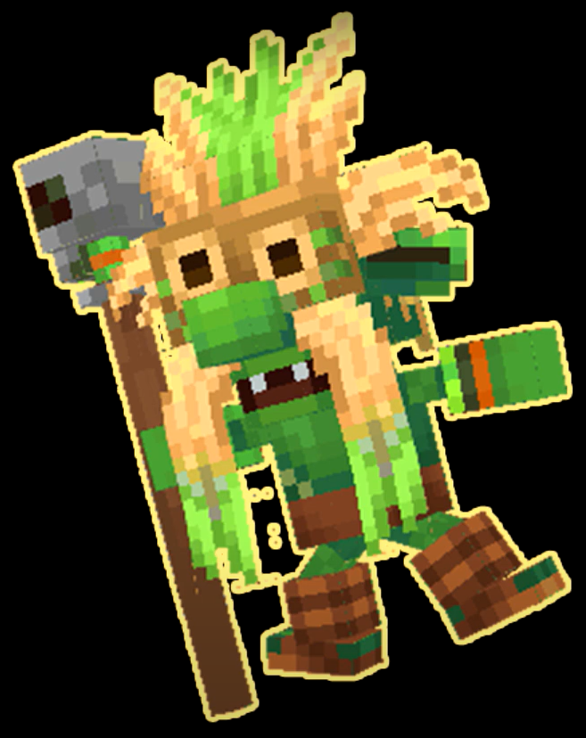
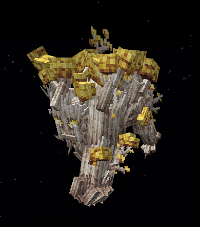
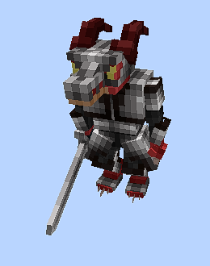

# Area Mons

***

## ป่าเริ่มต้น \[ Level 1 - 10 ]&#x20;




<figure><figcaption>
<strong>สลามทั่วไป</strong>
</figcaption></figure> <figure><figcaption>
<strong>สลามน้ำแข็ง</strong>
</figcaption></figure>

<table data-full-width="true"><thead><tr><th>ชื่อ</th><th>วัตถุดิบจากมอนสเตอร์</th><th>ของดรอป</th><th data-hidden data-type="files"></th></tr></thead><tbody><tr><td><strong>สลามทั่วไป</strong></td><td><a href="../monsters-loot/loot.md#world-1">เศษวิญญาณ</a></td><td></td><td></td></tr><tr><td><strong>สลามน้ำแข็ง</strong></td><td><a href="../monsters-loot/loot.md#world-1">ใบไม้วิญญาณ</a></td><td></td><td></td></tr></tbody></table>




<figure><figcaption>
<strong>สลามนักรบ</strong>
</figcaption></figure> <figure><figcaption>
<strong>สลามนักเวทย์</strong>
</figcaption></figure> <figure><figcaption>
<strong>จิตวิญญาณธรรมชาติ</strong>
</figcaption></figure>

| ชื่อ                  | วัตถุดิบจากมอนสเตอร์                                       | ของดรอป |
| --------------------- | ---------------------------------------------------------- | ------- |
| **สลามนักรบ**         | [ใบไม้วิญญาณชั้นสูง](../monsters-loot/loot.md#world-1)     |         |
| **สลามนักเวทย์**      | [เศษหินวิญญาณ](../monsters-loot/loot.md#world-1)           |         |
| **จิตวิญญาณธรรมชาติ** | [จิตวิญญาณหินพิทักษ์ป่า](../monsters-loot/loot.md#world-1) |         |



***

## แดนก๊อบลิ่น \[ 10 - 20 ]




<figure><figcaption>
<strong>ก๊อบลิ่น</strong>
</figcaption></figure> <figure><figcaption>
<strong>ก๊อบลิ่นนักธนู</strong>
</figcaption></figure>

|                    |                                                             |   |
| ------------------ | ----------------------------------------------------------- | - |
| **ก๊อบลิ่น**       | [**เศษไม้ของก็อบลิน**](../monsters-loot/loot.md#world-1)    |   |
| **ก๊อบลิ่นนักธนู** | [**เศษธนูไม้ของก็อบลิน**](../monsters-loot/loot.md#world-1) |   |




<figure><figcaption>
<strong>ก็อบลิ่นทหาร</strong>
</figcaption></figure> <figure><figcaption>
<strong>ก็อบลิ่นหมอผี</strong>
</figcaption></figure> <figure><figcaption>
<strong>ราชาก๊อบลิ่น</strong>
</figcaption></figure>

|                   |                                                                    |   |
| ----------------- | ------------------------------------------------------------------ | - |
| **ก็อบลิ่นทหาร**  | [**เศษโล่ของก็อบลิ่นทหาร**](../monsters-loot/loot.md#world-1)      |   |
| **ก็อบลิ่นหมอผี** | [**เบ็ดตกปลาไม้ของก็อบลิ่น**](../monsters-loot/loot.md#world-1)    |   |
| **ราชาก๊อบลิ่น**  | [**สร้อยเครื่องรางของก็อบลิ่น**](../monsters-loot/loot.md#world-1) |   |



***

## แดนผู้ล่า \[ 20 - 30 ]




<figure><figcaption>
<strong>ออคลูกน้อง</strong>
</figcaption></figure> <figure><figcaption>
<strong>ออคนักรบ</strong>
</figcaption></figure>

|                |                                                     |   |
| -------------- | --------------------------------------------------- | - |
| **ออคลูกน้อง** | [**เขี้ยวออค**](../monsters-loot/loot.md#world-1)   |   |
| **ออคนักรบ**   | [**เศษเนื้อออค**](../monsters-loot/loot.md#world-1) |   |




<figure><figcaption>
<strong>ออคนักรบขั้นสูง</strong>
</figcaption></figure> <figure><figcaption>
<strong>ออคนักธนู</strong>
</figcaption></figure> <figure><figcaption>
<strong>ออคยักษ์</strong>
</figcaption></figure>

|                     |                                                         |   |
| ------------------- | ------------------------------------------------------- | - |
| **ออคนักรบขั้นสูง** | [**ขวานออคขั้นสูง**](../monsters-loot/loot.md#world-1)  |   |
| **ออคนักธนู**       | [**ลูกธนูออค**](../monsters-loot/loot.md#world-1)       |   |
| **ออคยักษ์**        | [**กระบองออคยักษ์l**](../monsters-loot/loot.md#world-1) |   |



***

## พื้นที่ไร้ชีวี \[ 30 - 40 ]




<figure><figcaption>
<strong>โครงกระดูกนักรบ</strong>
</figcaption></figure> <figure><figcaption>
<strong>โครงกระดูกนักธนู</strong>
</figcaption></figure>

|                      |                                                             |   |
| -------------------- | ----------------------------------------------------------- | - |
| **โครงกระดูกนักรบ**  | [**ดาบเก่าแก่**](../monsters-loot/loot.md#world-1)          |   |
| **โครงกระดูกนักธนู** | [**เครื่องรางนักแม่นยำ**](../monsters-loot/loot.md#world-1) |   |





<figure><figcaption>
<strong>นักรบโครงกระดูกชั้นสูง</strong>
</figcaption></figure> <figure><figcaption>
<strong>โครงกระดูกนักบวช</strong>
</figcaption></figure> <figure><figcaption>
<strong>ผู้ควบคุมความตาย</strong>
</figcaption></figure>

|                            |                                                                 |   |
| -------------------------- | --------------------------------------------------------------- | - |
| **นักรบโครงกระดูกชั้นสูง** | [**หมวกนักรบเก่าแก่**](../monsters-loot/loot.md#world-1)        |   |
| **โครงกระดูกนักบวช**       | [**เครื่องรางอดีตผู้ศรัทธา**](../monsters-loot/loot.md#world-1) |   |
| **ผู้ควบคุมความตาย**       | [จอกของผู้ศรัทธา](../monsters-loot/loot.md#world-1)             |   |




***

## พื้นที่ถูกสาป \[ 40 - 50 ]




<figure><figcaption>
<strong>ลัทธิมืดย่ำราตรี</strong>
</figcaption></figure> <figure><figcaption>
<strong>ลัทธิมืดผู้บ้าคลั่ง</strong>
</figcaption></figure>

|                         |                                                      |   |
| ----------------------- | ---------------------------------------------------- | - |
| **ลัทธิมืดย่ำราตรี**    | [**กรงเล็บซากศพ**](../monsters-loot/loot.md#world-1) |   |
| **ลัทธิมืดผู้บ้าคลั่ง** | [**เขี้ยวพิษ**](../monsters-loot/loot.md#world-1)    |   |





<figure><figcaption>
<strong>ลัทธิมืดผู้หิวโหย</strong>
</figcaption></figure> <figure><figcaption>
<strong>ลัทธิมืดผู้กลืนกิน</strong>
</figcaption></figure> <figure><figcaption>
<strong>ลัทธิมืดผู้ทำลายล้าง</strong>
</figcaption></figure>

|                          |                                                             |   |
| ------------------------ | ----------------------------------------------------------- | - |
| **ลัทธิมืดผู้หิวโหย**    | [**กล่องเก็บความหิวโหย**](../monsters-loot/loot.md#world-1) |   |
| **ลัทธิมืดผู้กลืนกิน**   | [**ของบูชามืดมิด**](../monsters-loot/loot.md#world-1)       |   |
| **ลัทธิมืดผู้ทำลายล้าง** | [**หัวกระโหลกบูชายัน**](../monsters-loot/loot.md#world-1)   |   |




***

## พื้นที่จิตวิญญาณ \[ 50 - 60 ]




<figure><figcaption>
<strong>ภูติรับใช้เอลฟ์</strong>
</figcaption></figure> <figure><figcaption>
<strong>ภูติรับใช้เอลฟ์คราม</strong>
</figcaption></figure>

|                         |                                                             |   |
| ----------------------- | ----------------------------------------------------------- | - |
| **ภูติรับใช้เอลฟ์**     | [**ไม้วิเศษ**](../monsters-loot/loot.md#world-2)            |   |
| **ภูติรับใช้เอลฟ์คราม** | [**ไม้วิเศษมีจิตวิญญาณ**](../monsters-loot/loot.md#world-2) |   |




<figure><figcaption>
<strong>เอลฟ์นักรบ</strong>
</figcaption></figure> <figure><figcaption>
<strong>เอลฟ์นักธนู</strong>
</figcaption></figure>

|                 |                                                          |   |
| --------------- | -------------------------------------------------------- | - |
| **เอลฟ์นักรบ**  | [**ดาบเอลฟ์นักรบ**](../monsters-loot/loot.md#world-1)    |   |
| **เอลฟ์นักธนู** | [**ปลายธนูจิตวิญญาณ**](../monsters-loot/loot.md#world-1) |   |




***

## พื้นเอลฟ์ปกปักษ์ \[ 60 - 70 ]




<figure><figcaption>
<strong>เอลฟ์นักรบชั้นสูง</strong>
</figcaption></figure> <figure><figcaption>
<strong>เอลฟ์นักธนูชั้นสูง</strong>
</figcaption></figure>

|                        |                                                                 |   |
| ---------------------- | --------------------------------------------------------------- | - |
| **เอลฟ์นักรบชั้นสูง**  | [**ดาบเอลฟ์นักรบชั้นสูง**](../monsters-loot/loot.md#world-2)    |   |
| **เอลฟ์นักธนูชั้นสูง** | [**ปลายธนูจิตวิญญาณชั้นสูง**](../monsters-loot/loot.md#world-2) |   |




<figure><figcaption>
<strong>ต้นไม้กำลังโต</strong>
</figcaption></figure> <figure><figcaption>
<strong>ต้นไม้อ่อน</strong>
</figcaption></figure> <figure><figcaption>
<strong>ภูติปกปัก</strong>ษ์
</figcaption></figure>

|                   |                                                               |   |
| ----------------- | ------------------------------------------------------------- | - |
| **ต้นไม้อ่อน**    | [**สปอร์ต้นไม้**](../monsters-loot/loot.md#world-2)           |   |
| **ต้นไม้กำลังโต** | [**ดินกลายพันธุ์**](../monsters-loot/loot.md#world-2)         |   |
| **ภูติปกปัก**ษ์   | [**หนังผู้ปกปักษ์ชั้นสูง**](../monsters-loot/loot.md#world-2) |   |



***

## แดนกลายพันธุ์ \[ 70 - 80 ]




<figure><figcaption>
<strong>ต้นไม้กำลังโต</strong>
</figcaption></figure> <figure><figcaption>
<strong>ต้นไม้เติบโต</strong>
</figcaption></figure> <figure><figcaption>
<strong>ต้นไม้โตเต็มวัย (1)</strong>
</figcaption></figure>

|                         |                                                         |   |
| ----------------------- | ------------------------------------------------------- | - |
| **ต้นไม้กำลังโต**       | [**ดินกลายพันธุ์**](../monsters-loot/loot.md#world-2)   |   |
| **ต้นไม้เติบโต**        | [**เมล็ดต้นไม้อ่อน**](../monsters-loot/loot.md#world-2) |   |
| **ต้นไม้โตเต็มวัย (1)** | [**ดอกไม้อ่อน**](../monsters-loot/loot.md#world-2)      |   |




<figure><figcaption>
<strong>ต้นไม้กำลังโต</strong>
</figcaption></figure> <figure><figcaption>
<strong>ต้นไม้เติบโต</strong>
</figcaption></figure> <figure><figcaption>
<strong>ต้นไม้โตเต็มวัย (2)</strong>
</figcaption></figure>

<figure><figcaption>
<strong>ต้นไม้โตเต็มวัย (3)</strong>
</figcaption></figure> <figure><figcaption>
<strong>ต้นไม่ปีศาจ (1)</strong>
</figcaption></figure> <figure><figcaption>
<strong>ต้นไม่ปีศาจ (2)</strong>
</figcaption></figure>

|                         |                                                         |   |
| ----------------------- | ------------------------------------------------------- | - |
| **ต้นไม้กำลังโต**       | [**ดินกลายพันธุ์**](../monsters-loot/loot.md#world-2)   |   |
| **ต้นไม้เติบโต**        | [**เมล็ดต้นไม้อ่อน**](../monsters-loot/loot.md#world-2) |   |
| **ต้นไม้โตเต็มวัย (2)** | [ดอกไม้บาน](../monsters-loot/loot.md#world-2)           |   |
| **ต้นไม้โตเต็มวัย (3)** | [ผลไม้โตเต็มวัย](../monsters-loot/loot.md#world-2)      |   |
| **ต้นไม่ปีศาจ (1)**     | [น้ำทิพต้นไม้ปีศาจ](../monsters-loot/loot.md#world-2)   |   |
| **ต้นไม่ปีศาจ (2)**     | -                                                       |   |



***

## ทะเลทรายถูกสาป \[ 80 - 90 ]




<figure><figcaption>
<strong>โคบอลทะเลทราย</strong>
</figcaption></figure> <figure><figcaption>
<strong>โคบอลนักรบ</strong>
</figcaption></figure>

|                   |                                                    |   |
| ----------------- | -------------------------------------------------- | - |
| **โคบอลทะเลทราย** | [**เศษเกล็ด**](../monsters-loot/loot.md#world-2)   |   |
| **โคบอลนักรบ**    | [**อาวุธโคบอล**](../monsters-loot/loot.md#world-2) |   |





<figure><figcaption>
<strong>โคบอลนักรบหอก</strong>
</figcaption></figure> <figure><figcaption>
<strong>โคบอลนักธนู</strong>
</figcaption></figure> <figure><figcaption>
<strong>เจ้าแห่งทะเลทราย</strong>
</figcaption></figure>

|                      |                                                           |   |
| -------------------- | --------------------------------------------------------- | - |
| **โคบอลนักรบหอก**    | [**หอกโคบอล**](../monsters-loot/loot.md#world-2)          |   |
| **โคบอลนักธนู**      | [**ธนูโคบอล**](../monsters-loot/loot.md#world-2)          |   |
| **เจ้าแห่งทะเลทราย** | [**หินวิญญาณทะเลทราย**](../monsters-loot/loot.md#world-2) |   |




***

## ทะเลทรายของพระเจ้า \[ 90 - 100 ]




<figure><figcaption>
<strong>โคบอลอัศวิน</strong>
</figcaption></figure> <figure><figcaption>
<strong>โคบอลหมอผี</strong>
</figcaption></figure> <figure><figcaption>
<strong>เจ้าแห่งทะเลทราย</strong>
</figcaption></figure>

|                      |                                                           |   |
| -------------------- | --------------------------------------------------------- | - |
| **โคบอลอัศวิน**      | [โล่โคบอล](../monsters-loot/loot.md#world-2)              |   |
| **โคบอลหมอผี**       | [ขนนกสวมวิญญาณ](../monsters-loot/loot.md#world-2)         |   |
| **เจ้าแห่งทะเลทราย** | [**หินวิญญาณทะเลทราย**](../monsters-loot/loot.md#world-2) |   |




***

## พื้นที่หนาวเหน็บ \[ 100 - 110 ]




<figure><figcaption>
สลามเยือกแข็ง
</figcaption></figure> <figure><figcaption>
สัตว์ประหลาดเยือกแข็ง
</figcaption></figure>

|                       |                                                                 |   |
| --------------------- | --------------------------------------------------------------- | - |
| สลามเยือกแข็ง         | [แกนกลางสลามเยือกแข็ง](../monsters-loot/loot.md#world-3)        |   |
| สัตว์ประหลาดเยือกแข็ง | [เขี้ยวสัตว์ประหลาดเยือกแข็ง](../monsters-loot/loot.md#world-3) |   |




<figure><figcaption>
<strong>สลามเยือกแข็งขั้นสูง</strong>
</figcaption></figure> <figure><figcaption>
<strong>สัตว์ประหลายเยือกแข็งขั้นสูง</strong>
</figcaption></figure>

|                                  |                                                                        |   |
| -------------------------------- | ---------------------------------------------------------------------- | - |
| **สลามเยือกแข็งขั้นสูง**         | [**แกนกลางสลามเยือกแข็งชั้นสูง**](../monsters-loot/loot.md#world-3)    |   |
| **สัตว์ประหลายเยือกแข็งขั้นสูง** | [เขี้ยวสัตว์ประหลาดเยือกแข็งชั้นสูง](../monsters-loot/loot.md#world-3) |   |



***

## พื้นที่ราบหิมะ \[ 110 - 120 ]




<figure><figcaption>
<strong>สัตว์ประหลาดเยือกแข็งขั้นสูง</strong>
</figcaption></figure> <figure><figcaption>
<strong>ผู้พิทักษ์เยือกแข็ง</strong>
</figcaption></figure> <figure><figcaption>
<strong>สัตว์เปลือกแข็งเยือกเย็น</strong>
</figcaption></figure>

|                                  |                                                                            |   |
| -------------------------------- | -------------------------------------------------------------------------- | - |
| **สัตว์ประหลาดเยือกแข็งขั้นสูง** | [**เขี้ยวสัตว์ประหลาดเยือกแข็งชั้นสูง**](../monsters-loot/loot.md#world-3) |   |
| **ผู้พิทักษ์เยือกแข็ง**          | [**เปลือกปูเยือกแข็ง**](../monsters-loot/loot.md#world-3)                  |   |
| **สัตว์เปลือกแข็งเยือกเย็น**     | [**เปลือกปูเยือกแข็ง**](../monsters-loot/loot.md#world-3)                  |   |




<figure><figcaption>
<strong>สัตว์ประหลาดเยือดแข็งขันสูง</strong>
</figcaption></figure> <figure><figcaption>
<strong>สัตว์เปลือกแข็งเยือกเย็นขั้นสูง</strong>
</figcaption></figure> <figure><figcaption>
<strong>ผู้พิทักษ์แดนเยือกแข็งชั้นสูง</strong>
</figcaption></figure>

|                                     |                                                                            |   |
| ----------------------------------- | -------------------------------------------------------------------------- | - |
| **สัตว์ประหลาดเยือดแข็งขันสูง**     | [**เขี้ยวสัตว์ประหลาดเยือกแข็งชั้นสูง**](../monsters-loot/loot.md#world-3) |   |
| **สัตว์เปลือกแข็งเยือกเย็นขั้นสูง** | [**เปลือกปูเยือกแข็งชั้นสูง**](../monsters-loot/loot.md#world-3)           |   |
| **ผู้พิทักษ์แดนเยือกแข็งชั้นสูง**   | [**หินวิญญาณนักรบเยือกแข็ง**](../monsters-loot/loot.md#world-3)            |   |



***

## พื้นที่ราบอาทิตย์ \[ 120 - 130 ]




<figure><figcaption>
<strong>สัตว์ประหลายเยือดแข็งขั้นสูง</strong>
</figcaption></figure> <figure><figcaption>
<strong>ทหารเยือกแข็ง</strong>
</figcaption></figure> <figure><figcaption>
<strong>ภูติเยือกแข็ง</strong>
</figcaption></figure>

|                                  |                                                                            |   |
| -------------------------------- | -------------------------------------------------------------------------- | - |
| **สัตว์ประหลายเยือดแข็งขั้นสูง** | [**เขี้ยวสัตว์ประหลาดเยือกแข็งชั้นสูง**](../monsters-loot/loot.md#world-3) |   |
| **ทหารเยือกแข็ง**                | [**เศษเสี้ยวทหารน้ำแข็ง**](../monsters-loot/loot.md#world-3)               |   |
| **ภูติเยือกแข็ง**                | [**หินวิญญาณภูติน้ำแข็ง**](../monsters-loot/loot.md#world-3)               |   |



***

## พื้นที่ราบมิติมืด \[ 140 - 150 ]



<figure><figcaption></figcaption></figure>

|                                  |                                                                            |   |
| -------------------------------- | -------------------------------------------------------------------------- | - |
| **สัตว์ประหลายเยือดแข็งขั้นสูง** | [**เขี้ยวสัตว์ประหลาดเยือกแข็งชั้นสูง**](../monsters-loot/loot.md#world-3) |   |




<figure><figcaption>
<strong>สัตว์ประหลายเยือดแข็งขั้นสูง</strong>
</figcaption></figure> <figure><figcaption>
<strong>นักล่าแห่งมิติเยือกแข็ง</strong>
</figcaption></figure>

<figure><figcaption>
<strong>นักรบแห่งมิติเยือกแข็ง</strong>
</figcaption></figure> <figure><figcaption>
<strong>ปูมิติเยือกแข็ง</strong>
</figcaption></figure>

|                                   |                                                                               |   |
| --------------------------------- | ----------------------------------------------------------------------------- | - |
| **สัตว์ประหลายเยือดแข็งขั้นสูง**  | [**เขี้ยวสัตว์ประหลาดเยือกแข็งชั้นสูง**](../monsters-loot/loot.md#world-3)    |   |
| **นักล่าแห่งมิติเยือกแข็ง**       | [**หางนักล่าแห่งมิติมืดเยือกแข็งชั้นสูง**](../monsters-loot/loot.md#world-3)  |   |
| **นักรบแห่งมิติเยือกแข็งชั้นสูง** | [**จิตวิญญาณนักรบมิติมืดเยือกแข็งชั้นสูง**](../monsters-loot/loot.md#world-3) |   |
| **ปูมิติความมืดเยือกแข็ง**        | [**เศษปูน้ำแข็งมืดเยือกแข็ง**](../monsters-loot/loot.md#world-3)              |   |



***
